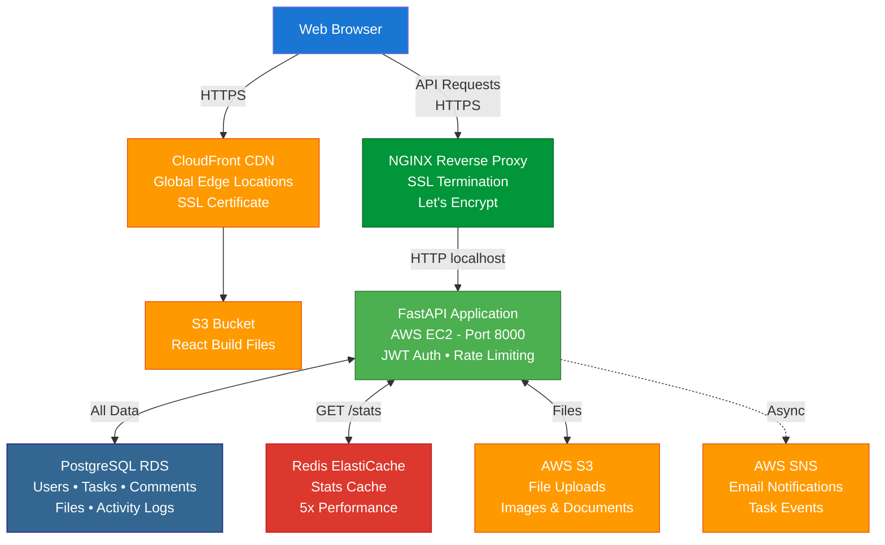

# FAROS Task Manager

A production-ready full-stack task management application with FastAPI backend and React frontend. Built to learn backend engineering fundamentals, cloud infrastructure, and modern deployment practices.

**Live Demo:** https://faros.odysian.dev

---

## What I Built

A complete task management system with:

**Core Features:**
- Full CRUD operations with advanced filtering, search, and pagination
- JWT authentication with secure password management
- Multi-user task sharing with granular RBAC permissions (Owner/Edit/View)
- File attachments via AWS S3
- Real-time comments system
- Comprehensive activity logging and audit trails
- Email notifications via AWS SNS
- Redis caching for performance optimization
- Rate limiting for security

**Quality:**
- **71 passing tests** with pytest (comprehensive coverage)
- Production-quality error handling and logging
- Automated CI/CD with zero-downtime deployments
- Infrastructure as Code (Terraform)
- 10/10 Pylint code quality score

---

## Architecture

### Full-Stack System Design


---

## Tech Stack

**Frontend:**
- React 18 with Vite
- Tailwind CSS for styling
- Axios for API communication
- Deployed on CloudFront + S3

**Backend:**
- FastAPI (Python 3.12)
- PostgreSQL with SQLAlchemy ORM
- Redis for caching
- AWS S3 for file storage
- AWS SNS for notifications
- JWT authentication with bcrypt
- Deployed on EC2 with NGINX

**Infrastructure:**
- Terraform for Infrastructure as Code
- Docker for containerization
- GitHub Actions for CI/CD
- AWS: EC2, RDS, ElastiCache, S3, SNS, CloudFront, ACM
- Let's Encrypt for SSL certificates

**Testing & Quality:**
- pytest with 71 tests
- Pylint, Black, isort for code quality
- GitHub Container Registry

---

## Features

### Task Management
- Create, read, update, delete tasks
- Advanced filtering (completion, priority, tags, overdue)
- Full-text search across title and description
- Sorting and pagination
- Bulk operations (update multiple tasks)
- Task statistics dashboard
- Tag management

### Authentication & Security
- User registration with email verification
- JWT-based authentication
- Password change (requires current password)
- Password reset via email (token-based)
- Rate limiting on sensitive endpoints
- Bcrypt password hashing

### Collaboration
- Share tasks with other users
- Three permission levels: Owner, Edit, View
- Permission-based access control
- Search users by username
- Revoke access anytime

### File Management
- Upload files to tasks (images, PDFs, documents)
- AWS S3 integration
- Download with permission checks
- Automatic cleanup on task deletion
- File size and type validation

### Comments
- Add comments to shared tasks
- Update/delete your own comments
- Permission-based visibility
- Comment activity tracking

### Activity Logging
- Comprehensive audit trail
- Tracks all user actions (create, update, delete, share)
- Captures old/new values for changes
- Filter by action type, resource, or date
- Task timeline view
- Activity statistics

### Notifications
- Event-driven emails (task sharing, completion, comments)
- Granular user preferences
- Email verification workflow
- Do Not Disturb mode
- AWS SNS integration

### Performance
- Redis caching on stats endpoint (5x faster)
- Background tasks for async operations
- Eager loading to prevent N+1 queries
- Strategic database indexing

---

## Project Structure

### Backend (task-manager-api)
```
task-manager-api/
├── main.py                      # FastAPI app, CORS, middleware
├── core/                        # Core utilities
│   ├── exceptions.py            # Custom exception classes
│   ├── logging._config.py       # Logger setup
│   ├── rate_limit_config.py     # Rate limiting setup
│   ├── redis_config.py          # Redis caching
│   ├── security.py              # Password hashing, JWT tokens
│   └── tokens.py                # Token generation and verification
├── schemas/                     # Pydantic models (request/response)
│   ├── auth.py                  # Auth schemas
│   ├── task.py                  # Task schemas
│   ├── comment.py               # Comment schemas
│   ├── activity.py              # Activity schemas
│   └── ...
├── db_models.py                 # SQLAlchemy models (database tables)
├── db_config.py                 # Database connection
├── dependencies.py              # FastAPI dependencies
├── logging_config.py            # Structured logging
├── services/                    # Business logic layer
│   ├── activity_service.py      # Activity logging service
│   ├── background_tasks.py      # Background task functions
│   └── notifications.py         # SNS, SES clients and helper functions
├── routers/                     # API endpoints
│   ├── auth.py                  # Registration, login, password reset
│   ├── users.py                 # User profile, password change
│   ├── tasks.py                 # Task CRUD operations
│   ├── sharing.py               # Task sharing endpoints
│   ├── comments.py              # Comment endpoints
│   ├── files.py                 # File upload/download
│   ├── activity.py              # Activity log endpoints
│   ├── notifications.py         # Notification preferences
│   └── health.py                # Health check
├── tests/                       # 71 pytest tests
├── alembic/                     # Database migrations
├── terraform/                   # Infrastructure as Code
│   ├── main.tf                  # Provider configuration
│   ├── ec2.tf                   # EC2 instance with user_data
│   ├── rds.tf                   # PostgreSQL database
│   ├── elasticache.tf           # Redis cluster
│   ├── s3_frontend.tf           # S3 bucket for frontend
│   ├── cloudfront.tf            # CloudFront distribution
│   ├── acm.tf                   # SSL certificates
│   ├── security_groups.tf       # Network isolation
│   ├── variables.tf             # Input variables
│   └── outputs.tf               # Exported values
├── .github/workflows/           # CI/CD pipelines
│   ├── test.yml                 # Run tests on PR
│   ├── infrastructure.yml       # Manage Terraform infrastructure
│   └── deploy.yml               # Deploy on merge to main
├── Dockerfile                   # Production container
├── docker-compose.yml           # Local development
└── requirements.txt             # Python dependencies
```

### Frontend (task-manager-frontend)
```
task-manager-frontend/
├── src/
│   ├── components/
│   │   ├── Auth/                # Login, Register, Password Reset
│   │   ├── Tasks/               # Task list, forms, dashboard
│   │   ├── Settings/            # User settings, security
│   │   ├── Activity/            # Activity timeline
│   │   └── Common/              # Shared components
│   ├── pages/                   # Page-level components
│   ├── api.js                   # Axios configuration
│   ├── App.jsx                  # Main app component
│   └── main.jsx                 # Entry point
├── .github/workflows/
│   └── deploy.yml               # S3 deployment on push
└── package.json                 # Dependencies
```

---

## API Endpoints

### Authentication
```
POST   /auth/register                  - Create account
POST   /auth/login                     - Get JWT token
POST   /auth/password-reset/request    - Request password reset
POST   /auth/password-reset/verify     - Complete password reset
```

### User Management
```
GET    /users/me                       - Get current user profile
PATCH  /users/me/change-password       - Change password (requires current)
GET    /users/search                   - Search users by username
```

### Tasks
```
GET    /tasks                          - List tasks (filters, search, pagination)
POST   /tasks                          - Create task
GET    /tasks/stats                    - Task statistics (cached)
PATCH  /tasks/bulk                     - Update multiple tasks
GET    /tasks/{id}                     - Get single task
PATCH  /tasks/{id}                     - Update task
DELETE /tasks/{id}                     - Delete task
POST   /tasks/{id}/tags                - Add tags
DELETE /tasks/{id}/tags/{tag}          - Remove tag
```

### Sharing
```
POST   /tasks/{id}/share               - Share task with user
GET    /tasks/shared-with-me           - List shared tasks
PUT    /tasks/{id}/share/{username}    - Update permission level
DELETE /tasks/{id}/share/{username}    - Revoke access
```

### Comments
```
POST   /tasks/{id}/comments            - Add comment
GET    /tasks/{id}/comments            - List comments
PATCH  /comments/{id}                  - Update comment
DELETE /comments/{id}                  - Delete comment
```

### Files
```
POST   /tasks/{id}/files               - Upload file
GET    /tasks/{id}/files               - List files
GET    /files/{id}                     - Download file
DELETE /files/{id}                     - Delete file
```

### Activity
```
GET    /activity                       - Activity history (with filters)
GET    /activity/tasks/{id}            - Task timeline
GET    /activity/stats                 - Activity statistics
```

### Notifications
```
GET    /notifications/preferences      - Get preferences
PATCH  /notifications/preferences      - Update preferences
POST   /notifications/send-verification - Send verification email
POST   /notifications/verify           - Verify email
```

---

## Deployment

### Live URLs
- **Frontend:** https://faros.odysian.dev
- **Backend API:** https://api.faros.odysian.dev
- **API Docs:** https://api.faros.odysian.dev/docs

### Infrastructure (Terraform)

**16 AWS resources** fully automated:

**Frontend:**
- S3 bucket for static hosting
- CloudFront distribution with global CDN
- ACM SSL certificate for HTTPS
- Automated deployment via GitHub Actions

**Backend:**
- EC2 instance with NGINX reverse proxy
- Let's Encrypt SSL (automated via user_data)
- IAM role for S3 access (no hardcoded credentials)
- Elastic IP for consistent addressing

**Data Layer:**
- RDS PostgreSQL (with automated backups)
- ElastiCache Redis (for caching)
- S3 bucket for file uploads
- SNS topic for email notifications

**Security:**
- 3 security groups (EC2, RDS, ElastiCache)
- HTTPS enforced on all endpoints
- CORS configured for production domains
- SSL certificates auto-renewed
```bash
# Deploy entire infrastructure
cd terraform/
terraform init
terraform apply  # ~15 minutes

# Destroy when not needed (cost optimization)
terraform destroy  # $0/month when off
```

### CI/CD Pipelines

**Backend (GitHub Actions):**
1. **On Pull Request:** Run 71 tests with PostgreSQL + Redis
2. **On Merge to Main:**
   - Build Docker image with layer caching (~20 sec)
   - Push to GitHub Container Registry
   - SSH to EC2 and run blue-green deployment
   - Health checks verify new version
   - Automatic rollback on failure
   - **Total deployment time:** ~60 seconds
   - **Downtime:** ~2 seconds

**Frontend (GitHub Actions):**
1. **On Push to Main:**
   - Install dependencies and build React app
   - Sync build files to S3
   - Invalidate CloudFront cache
   - **Total deployment time:** ~2 minutes

### User Data Automation

EC2 bootstrap script automatically:
- Installs Docker, NGINX, Certbot, PostgreSQL client
- Clones repository from GitHub
- Waits for RDS to be available
- Creates database (idempotent)
- Configures NGINX reverse proxy
- Builds and runs Docker container
- Obtains SSL certificate from Let's Encrypt
- Sets up auto-renewal
- **Result:** Complete HTTPS backend in ~15 minutes

---

## Testing
```bash
# Run all tests
pytest

# Run with verbose output
pytest -v

# Run with coverage report
pytest --cov

# Run specific test file
pytest tests/test_auth.py
```

**Test Coverage:** 71 tests covering:
- Authentication (register, login, password reset)
- Task CRUD operations
- Sharing and permissions
- Comments and files
- Activity logging
- Background tasks
- Caching behavior
- Rate limiting

---

## Local Development

### Prerequisites
- Python 3.12+
- PostgreSQL 15+
- Redis 7+
- Node.js 18+ (for frontend)

### Backend Setup
```bash
# Clone and enter directory
git clone https://github.com/odysian/task-manager-api
cd task-manager-api

# Create virtual environment
python -m venv venv
source venv/bin/activate  # On Windows: venv\Scripts\activate

# Install dependencies
pip install -r requirements.txt

# Set up databases
createdb task_manager
createdb task_manager_test

# Start Redis
sudo systemctl start redis-server

# Create .env file (use .env.example as template)
cp .env.example .env
# Edit .env with your values

# Run migrations
alembic upgrade head

# Start development server
uvicorn main:app --reload
```

Visit http://localhost:8000/docs for interactive API documentation.

### Frontend Setup
```bash
# Clone and enter directory
git clone https://github.com/odysian/task-manager-frontend
cd task-manager-frontend

# Install dependencies
npm install

# Start development server
npm run dev
```

Visit http://localhost:5173

### Docker Compose (Easiest)
```bash
# Start all services (PostgreSQL, Redis, API)
docker-compose up

# Run in background
docker-compose up -d

# View logs
docker-compose logs -f api

# Stop all services
docker-compose down
```

---

## Database Schema

**Key Tables:**
- `users` - User accounts and authentication
- `tasks` - Task data with owner relationship
- `task_shares` - Many-to-many sharing with permission levels
- `task_comments` - Comments on tasks
- `task_files` - File metadata (actual files in S3)
- `activity_logs` - Complete audit trail (polymorphic pattern)
- `notification_preferences` - User notification settings

**Design Patterns:**
- Polymorphic activity logging (tracks multiple resource types)
- JSON columns for flexible metadata storage
- Strategic indexing for query performance
- Cascade deletes for data integrity

---

## What I Learned

### Backend Development
- REST API design with FastAPI
- SQLAlchemy ORM and database migrations
- JWT authentication and password security
- Multi-user data isolation
- Role-based access control (RBAC)
- Service layer architecture
- Background task processing

### Cloud & Infrastructure
- AWS services (EC2, RDS, ElastiCache, S3, SNS, CloudFront)
- Infrastructure as Code with Terraform
- SSL certificate management (ACM + Let's Encrypt)
- NGINX reverse proxy configuration
- Docker containerization
- Blue-green deployments

### Testing & Quality
- Comprehensive test coverage with pytest
- Test database isolation
- Mocking external services (S3, SNS)
- CI/CD pipeline design
- Production logging strategies

### Performance
- Redis caching patterns
- N+1 query prevention
- Database query optimization
- CDN configuration

### Key Insights
- **Activity logging:** Transaction safety is critical (log before commit)
- **Permissions:** Centralized guards prevent duplicate authorization logic
- **Testing:** Revealed multiple bugs (completed field, status codes, registration)
- **Caching:** Simple but effective (5x performance improvement)
- **Background tasks:** Don't make users wait for slow operations
- **Blue-green deployment:** Zero-downtime releases build user trust

---

## Cost Optimization

**During Development:** Free tier covers everything

**After Free Tier:**
- **Running 24/7:** ~$50/month
- **On-Demand Strategy:** $0 when destroyed

**Cost-Effective Deployment:**
```bash
# When not needed
terraform destroy  # $0/month

terraform apply    # ~15 minutes to full deployment

terraform destroy  # Back to $0/month
```

**Alternative:** Migrate frontend to Netlify (free forever), keep backend on AWS (~$35/month)

---

## Resources

- [FastAPI Documentation](https://fastapi.tiangolo.com/)
- [SQLAlchemy 2.0 Documentation](https://docs.sqlalchemy.org/en/20/)
- [Terraform AWS Provider](https://registry.terraform.io/providers/hashicorp/aws/latest/docs)
- [pytest Documentation](https://docs.pytest.org/)
- [React Documentation](https://react.dev/)

---

## Repository Links

- **Backend API:** https://github.com/odysian/task-manager-api
- **Frontend React App:** https://github.com/odysian/task-manager-frontend

---

## Contact

**Chris**
- GitHub: [@odysian](https://github.com/odysian)
- Portfolio: https://odysian.dev

---

## License

MIT License - feel free to use this project as a learning reference.
